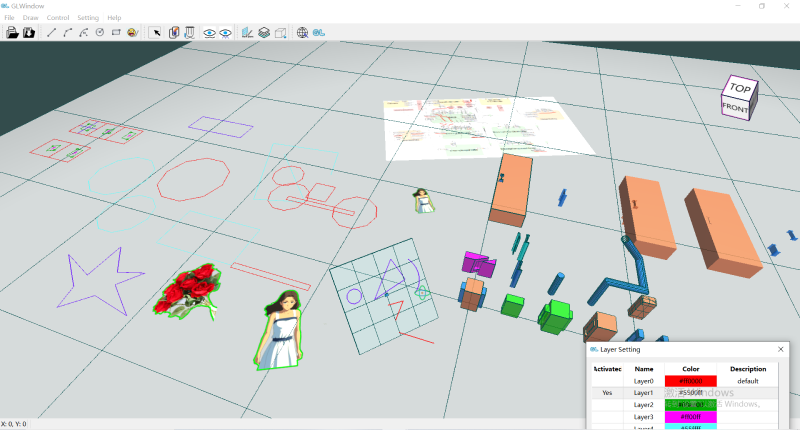

# `GLViewer` overview
`GLViewer` is a free, open-source and interesting `3D CAD software` based on `QT` & `OpenGL` & `CGLib`.

<figcaption style="text-align: center;">图：GLViewer</figcaption>

!!! note "About the code"
    + Here has the full course code which divided by the features chapters. You can read and get familiar with it according to the directory chapters. 
    + If you want to directly obtain and use the code with complete features, you can start from the `GLViewer` folder, where the latest and complete code is available.

If you want to learn the technical and code logic of the course, ***you can visit the [www.cglib.net](https://www.cglib.net) website, where you can find the full and free course documentation***.

!!! important
    + It is worth mentioning that the author ***recorded a detailed video explanation course***, the video course will help you fully learn and master the technology of this project.
    + if you have the conditions, it is recommended to buy the video course on [哔哩哔哩bilibili](https://space.bilibili.com/386294314) or [CSDN](https://edu.csdn.net/course/detail/40091)

you can learn more infomation on the [www.cglib.net](https://www.cglib.net) website.

# Get Started
`GLViewer` is based on `QT` & `OpenGL` & `CGLib`, so you need to download and configure `some libraries`.

you can learn more on **[Setup the development environment of GLViewer](https://www.cglib.net/01%20setup%20the%20development%20environment/)**.

1. Download and configure `Visual Studio 2022`, `CMAKE`, `QT 6`, `mingw-w64`, `ninja`, `vcpkg` and `git`. 
  + Don't be afraid, you already have a lot of them, and even if you don't, it's easy to do on following `the link above` or the `video course`.
2. On your computer and enter the folder you want to put the repository (like `D:\course-code`). Then open the `Git Bash`, input and execute `git clone https://github.com/hashixuehua/GLViewer.git`.
3. Download the dependency libraries, include [cglib](https://www.cglib.net/intro/), [rapidjson](https://github.com/Tencent/rapidjson) and put them in `dependencies` folder, like `D:\course-code\dependencies`.
4. Enter the folder which has the `root cmakelist` file (like `D:\course-code\GLViewer\GLViewer`), right click and use `Visual Studio 2022` to open the project. Also, you can use `QT Creator` to open the peoject.
5. build and run.

!!! important
    it is recommended to **star** this repository, it is important to us.
    建议对仓库进行**star**，这对我们很重要。

# How to Sponsor
Here's how you can sponsor the author:

+ Sponsorships can be done via [OpenCollective](https://opencollective.com/cglib)
+ or `buy video course` on [哔哩哔哩bilibili](https://space.bilibili.com/386294314) or [CSDN](https://edu.csdn.net/course/detail/40091)
+ or use `WeChat` to follow the author's `WeChat public account`(微信公众号 `哈市雪花`) and open any article to sponsor.

# License
The code in this repository is licensed under the MIT License. The libraries provided by ports are licensed under the terms of their original authors. 

# Author
Copyright (C) 2017~2025 哈市雪花

**微信公众号：[哈市雪花](https://mp.weixin.qq.com/s/KRMuyvCr70Nuw5ZW0HWasw)**

All information and updates are on the website, welcome to follow: [www.cglib.net](https://www.cglib.net).